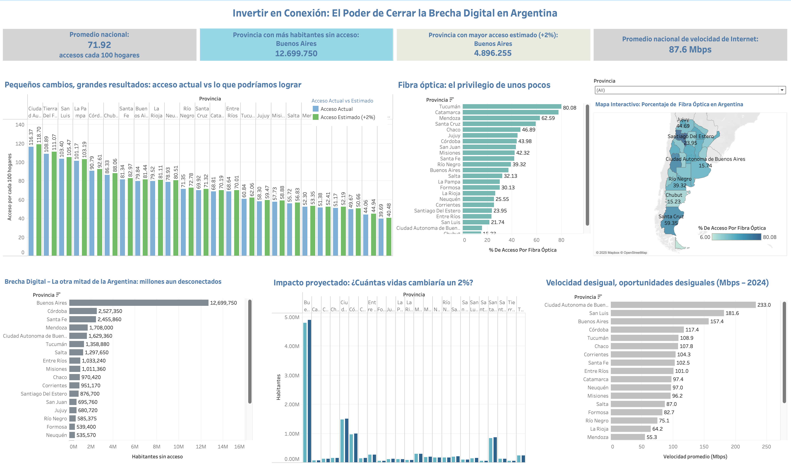

# Análisis del Acceso a Internet y las Brechas de Conectividad en las Provincias de Argentina (2024)

## 🧠 Contexto y Objetivo

En la actualidad, el acceso a internet es un factor determinante para el desarrollo económico, social y educativo de cualquier región. En Argentina, a pesar de contar con un número considerable de conexiones, persisten grandes desigualdades entre provincias en términos de cobertura, velocidad de navegación y adopción de tecnologías como la fibra óptica.

Este proyecto fue desarrollado con el objetivo de brindar a una empresa prestadora de servicios de telecomunicaciones una visión clara del estado actual del acceso a internet en todo el país. A través del análisis exploratorio de datos y visualizaciones interactivas, se busca:

- Evaluar el nivel de conectividad por provincia.
- Identificar las regiones con mayor brecha digital.
- Estimar el impacto potencial de una mejora del 2% en la cobertura.
- Proponer KPIs relevantes para la toma de decisiones.

## 💡 Hipótesis

A pesar de que Argentina cuenta con una importante infraestructura de telecomunicaciones en términos generales, existen marcadas desigualdades entre provincias en cuanto a la disponibilidad, calidad y tecnología del servicio de internet. Se espera encontrar que las provincias con menor densidad poblacional y menor desarrollo económico presentan los niveles más bajos de acceso y menor adopción de fibra óptica.

## 📊 KPIs definidos

Durante el desarrollo del proyecto se definieron cinco indicadores clave (KPIs) con el objetivo de cuantificar y monitorear los aspectos más relevantes del acceso a internet en las provincias de Argentina. Estos KPIs permiten analizar la situación actual, proyectar mejoras y priorizar decisiones de inversión en conectividad.

### 🟡 KPI 1 – Proyección de incremento de acceso (+2%)
**Objetivo:** Medir el impacto de un aumento del 2% en el acceso a internet por cada 100 hogares en cada provincia.  
**Fórmula:** ((Nuevo acceso - Acceso actual) / Acceso actual) * 100  
**Visualización:** Gráfico de barras agrupadas por provincia y tarjeta resumen.

### 🟡 KPI 2 – Porcentaje de acceso por fibra óptica
**Objetivo:** Identificar la penetración de tecnología de alta velocidad (fibra óptica) en cada provincia.  
**Fórmula:** (Conexiones por fibra óptica / Total de conexiones) * 100  
**Visualización:** Mapa de calor interactivo por provincia y gráfico de barras.

### 🟡 KPI 3 – Habitantes sin acceso a internet
**Objetivo:** Detectar las provincias con mayor cantidad absoluta de personas excluidas digitalmente.  
**Fórmula:** Población estimada - (Accesos por cada 100 hab. * Población / 100)  
**Visualización:** Gráfico de barras horizontal y tarjeta resumen.

### 🟡 KPI 4 – Habitantes con acceso estimado (+2%)
**Objetivo:** Estimar la cantidad total de personas que ganarían acceso a internet si se implementara el aumento proyectado.  
**Fórmula:** (Accesos por cada 100 hab. * 1.02) * Población / 100  
**Visualización:** Gráfico de comparación lado a lado y tarjeta resumen.

### 🟡 KPI 5 – Velocidad promedio nacional
**Objetivo:** Ofrecer una métrica global de calidad del servicio.  
**Fórmula:** Promedio simple de la velocidad de bajada por provincia.  
**Visualización:** Tarjeta resumen de velocidad promedio y gráfico de barras por provincia.

## 🔍 Exploratory Data Analysis (EDA) y Metodología

### 🗃️ Fuentes y preparación de los datos

El dataset utilizado proviene de la base de datos oficial de ENACOM (Ente Nacional de Comunicaciones) sobre indicadores de acceso a internet fijo en Argentina, actualizado al segundo trimestre del año 2024.

Se incluyeron las siguientes variables clave:

- Accesos por cada 100 hogares y habitantes.
- Tecnología de conexión (fibra óptica, cablemodem, ADSL, etc.).
- Velocidad promedio de bajada (Mbps).
- Población estimada por provincia.

Los datos fueron tratados, integrados y transformados en un único archivo `.csv`, corregido y estructurado para su uso directo en Tableau. Se eliminaron valores nulos, se ajustaron nombres de provincias para visualización geográfica, y se generaron columnas calculadas para cada uno de los KPIs.

### 🧪 Análisis exploratorio

El EDA fue realizado en un notebook de Python utilizando Pandas y se centró en:

- Revisión de la completitud y consistencia del dataset.
- Cálculo de estadísticas descriptivas básicas.
- Confirmación de la viabilidad para visualización en Tableau.

### ⚙️ Metodología aplicada

1. **Integración de fuentes:** Selección y unificación de datos oficiales en un archivo único.
2. **Cálculo de KPIs personalizados:** Implementación de fórmulas diseñadas para reflejar cobertura, calidad y brechas.
3. **Visualización y diseño del dashboard:** Desarrollo en Tableau Public, orientado al análisis interactivo por provincia.
4. **Interactividad:** Inclusión de filtros por provincia, mapas y tarjetas resumen para facilitar el storytelling y la toma de decisiones.

## 📈 Conclusiones

1. **Desigualdad en el acceso:** Existen diferencias marcadas entre provincias en cuanto al acceso a internet por cada 100 hogares. Provincias como La Pampa y Formosa no alcanzan el 50% de acceso por hogar, mientras que otras superan el 100%.
2. **Impacto del aumento del 2%:** La implementación de una mejora del 2% en los accesos por cada 100 hogares generaría un incremento significativo en provincias con alta población, especialmente Buenos Aires, Córdoba y Santa Fe.
3. **Brecha digital:** Buenos Aires concentra el mayor número de habitantes sin acceso a internet, lo cual refuerza la necesidad de priorizar las políticas de expansión en las zonas más pobladas.
4. **Velocidad desigual:** San Luis y CABA tienen velocidades muy superiores al promedio; Chubut y Tierra del Fuego, muestran velocidades preocupantemente bajas.
5. **Adopción de fibra óptica baja en regiones clave:** Algunas provincias con alta población aún tienen bajos porcentajes de conexión por fibra óptica, como Buenos Aires, Santiago del Estero y La Rioja, lo que puede impactar negativamente en la calidad del servicio

## 📝 Recomendaciones

1. **Priorizar inversiones en provincias con baja penetración y alta población:** En particular: Buenos Aires, La Pampa, Tierra del Fuego y Chubut, donde se combinan baja velocidad, bajo acceso por fibra óptica y grandes cantidades de personas aún no conectadas.
2. **Aplicar metas escalables por provincia:** Mejoras como el 2% permiten planificar por trimestres. Estas proyecciones permiten medir impacto real y planificar presupuestos de forma escalable y tangible.
3. **Expandir la fibra óptica en regiones con infraestructura instalada:** En provincias como Córdoba, Mendoza o Santa Fe, donde puede aprovecharse la base instalada.
4. **Considerar el contexto socioeconómico:** Considerar factores como densidad poblacional y poder adquisitivo, ya que los números duros deben ser interpretados en su contexto geográfico y económico.

## 📂 Archivos del Repositorio

- `dataset_telecom_final_para_mapas.csv`: Dataset definitivo utilizado para todas las visualizaciones y KPIs.
- `EDA_notebook.ipynb`: Análisis exploratorio de datos en Python.
- `tableau_dashboard.png`: Captura del dashboard interactivo.
- `README.md`: Documento principal del proyecto.

## 👨‍💻 Autor

Michel Torrealba  
Analista de Datos
